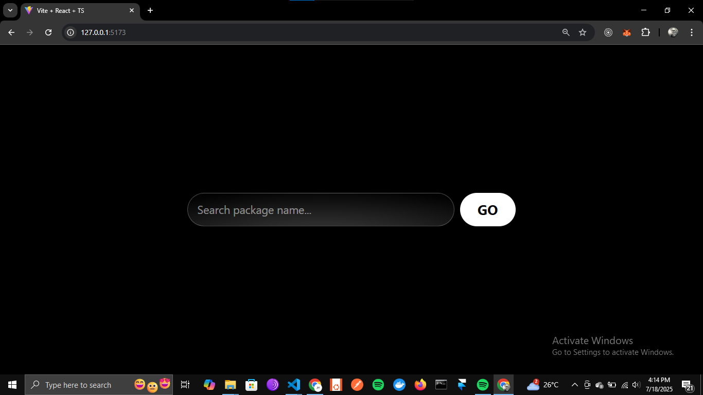
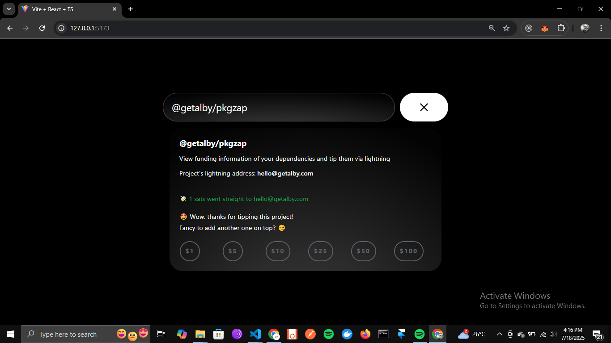

# ⚡ PkgZap-Widget

**PkgZap Widget** is an embeddable widget that lets you search for npm packages that support [Bitcoin Lightning](https://lightning.network/) funding via `zap`, and instantly send them sats.

> A fun way to support open source maintainers — directly from your site.

## ✨ Features

- 🔍 Search for npm packages with a `zap` field in their `package.json`
- ⚡ Send Lightning payments instantly via WebLN or LNURL
- 🧩 Embeddable widget for easy integration into any site
- 🌐 Works beautifully with Alby, LNBits, and other Lightning wallets

## 📸 Demo

Here’s what the widget looks like in action:

### 🔎 Search and Discover

### ⚡ Lightning Payment Prompt

### ✅ Payment Success

## 🧩 Embed It

Coming soon: instructions on how to embed the widget into your site.

## 📦 Powered By

* [Nostr](https://nostr.com/)
* [Bitcoin Lightning Network](https://lightning.network/)
* [Alby](https://getalby.com/)
* [npm](https://www.npmjs.com/)

## 🙌 Support or Contribute

Have a suggestion or want to contribute? Open an issue or submit a pull request — every zap, star, or PR is appreciated.

## ⚖️ License

MIT — do what you want, just give credit.

Made with ⚡ by Alby Contributors.
